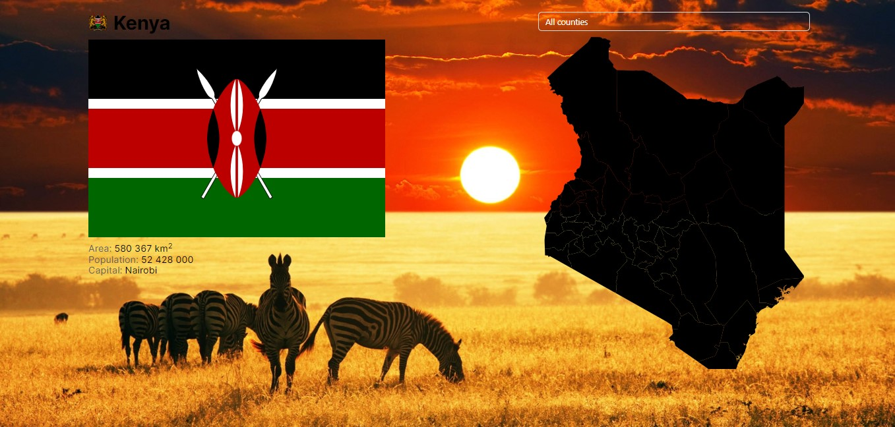

# 𝕂𝕖𝕟𝕪𝕒 𝕔𝕠𝕦𝕟𝕥𝕚𝕖𝕤

  

This project was created using [Vite](https://vitejs.dev/) + [Create React App](https://github.com/facebook/create-react-app). 

## 𝔽𝕖𝕒𝕥𝕦𝕣𝕖𝕤 𝕒𝕟𝕕 𝕋𝕖𝕔𝕙𝕟𝕠𝕝𝕠𝕘𝕚𝕖𝕤 ᎓    

  </a>&nbsp;
  &nbsp;
  &nbsp;
  &nbsp;
  &nbsp;
  &nbsp;
  &nbsp;  
  
※ The app allows you to find out the location, flag, and small statistics for any selected county in Kenya.  
※ Originally created for my personal use.  

※ [Vite.js](https://vitejs.dev/) & [React.js](https://react.dev): for building user interfaces.   
※ [Styled Components](https://styled-components.com): Styling library for React components.  
※ [Ant Design](https://ant.design/): library of user interface components.  

## 𝕀𝕟𝕤𝕥𝕒𝕝𝕝𝕒𝕥𝕚𝕠𝕟 ᎓  

To get started with this project, follow the installation instructions below.

1. Clone the repository:
   ```bash
   git clone https://morifer79.github.io/kenya-counties.git
   cd kenya-counties-app
   ```
2. Install the dependencies:
   ```bash
   npm install
   ```
3. Start the development server:
   ```bash
   npm start
   ```
4. Open to view it in the browser:  
<a href="https://morifer79.github.io/kenya-counties/"></a>  

## 𝔼𝕞𝕒𝕚𝕝 𝕞𝕖 ᎓
Questions, suggestions, help:  
<a href="mailto:cyber-morifer@proton.me"></a>
   
